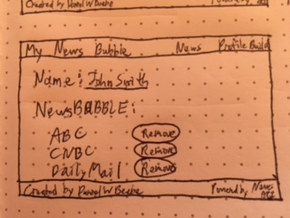

*** Daniel W. Beebe / Monday, July 31, 2017 ***

# 'My News Bubble' App Proposal

## What is 'My News Bubble'?

'My News Bubble' is an app in which users can register and create a unqiue profile of their favorite news sources.

When a user logs in, the app will list over a dozen major news sources to choose from. The user simply has to click an 'add' button to add the news source to that users 'bubble'.

The user can always go back to the user's 'bubble' (profile) and remove a news source later.

The heart of the app is the user's news feed, which will include the top news stories from the user's selected favorite news sources.

## Wireframe

Welcome screen

After logging in, the user selects preferred news sources from a menu of options

The user has an individual profile page

The user's news feed is the main feature of the app

## Phases of Completion

* Phase -4: Create file structure and detailed outline of the logic of the app
* Phase -3: Set up database for user verification and user profiles
* Phase -2: Set up views for each page of the app
* Phase -1: Work on CSS syling of app
* Phase 0: Complete working news app
* Phase 1: Deploy app to Heroku

## Resources

I will use the API key from: https://newsapi.org/

