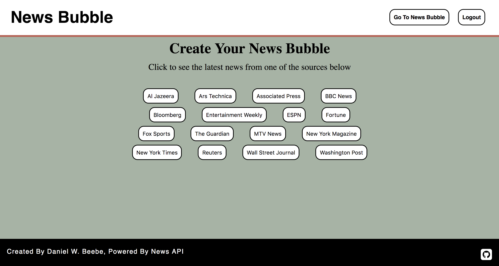
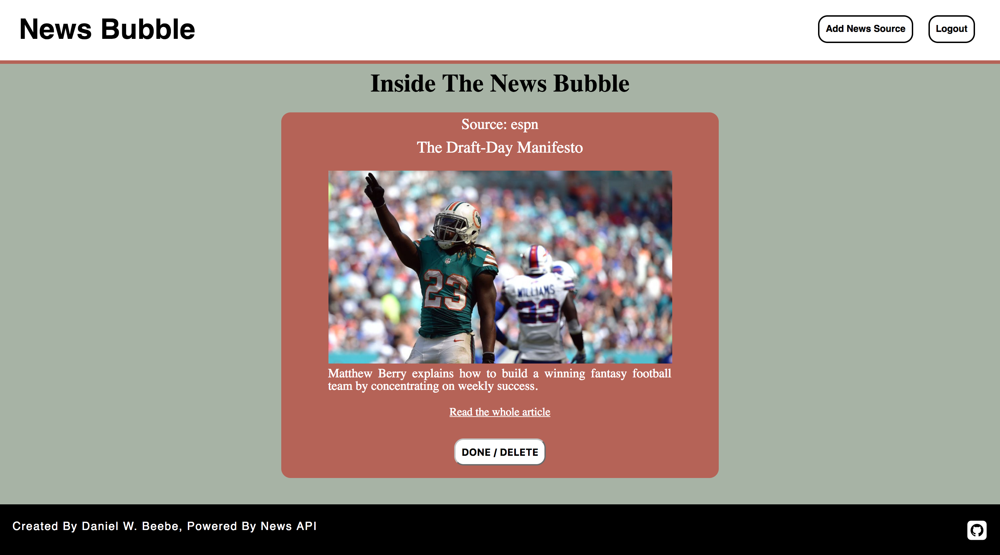

# 'My News Bubble' App

## What is 'My News Bubble'?

'My News Bubble' is an app in which users can register and create a unqiue profile of their favorite news sources.

When a user logs in, the app will list over a dozen major news sources to choose from. The user simply has to click an 'add' button to add the news source to that users 'bubble'.

The user can always go back to the user's 'bubble' (profile) and remove a news source later.

The heart of the app is the user's news feed, which will include the top news stories from the user's selected favorite news sources.

## Technical Discussion

The app utilizes the following technologies:

* HTML/EJS (general framework for the page views)
* CSS (style, formatting, adaptive design for web browser width)
* JavaScript (functions for models, controllers, routes, and config file)
* SQL (migration file, communicate with database with tables for registered users and news sources selected by users)
* Express.js (for the web app framework)
* API Call (retreieve news data to display)

### Notes on App Structure

In terms of structure, the app is broken down into 3 parts: (1) login/registration; (2) news source selection; and (3) viewing the top news article from the selected news source. 

### Sample Code

Here is the code fro the views/sources/sources-index.ejs file - used to display the top news articel from the selected news source.

    <% for (let source of data) { %>

      

          <h4>Source: <%= source.source %></h4>
          
<%= source.title %>
 
          
">

          
<%= source.description %>
 
          
<a href="<%= source.url %>" target="_blank">Read the whole article</a>
 
          <form method='POST' action='/sources/<%= source.id %>?_method=DELETE'>
          <input id="remove-button" type='submit' value='DONE / BACK' />
          </form>
      

    <% } %>
  

## Opportunities for Future Growth

In terms of future edits, I would like to allow the user to select several news sources to display in the view, and remove buttons for any news sources already selected in order to prevent a user from accidentally selecting the same news source twice.
